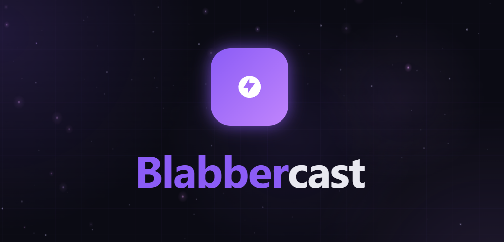

# Blabbercast

Blabbercast is a Windows-first, local-only text-to-speech dashboard for livestream chat. It reads Twitch and YouTube live chat, filters messages, queues them, and speaks them through local Piper voices by default.

The app runs on `127.0.0.1`, so it is meant for the streamer sitting at the machine, not remote control or hosted use.

## Dependencies And Requirements

- Windows 10 or 11.
- Node.js 18 or newer with npm.
- Python 3.9 or newer with pip.
- PowerShell, included with Windows, for setup downloads.
- Internet access during setup for npm packages, Python packages, Piper, and Piper voice models.

The GitHub source repo does not include generated or bulky local files such as `node_modules/`, `runtime/`, `models/`, or `Blabbercast.exe`.

## Features

- Twitch chat support through `tmi.js`.
- YouTube live chat support through `youtube-chat`.
- Local Piper neural TTS by default, with downloadable voice packs.
- Optional Microsoft SAPI and Edge TTS engines.
- Browser dashboard for queue status, controls, voice selection, logs, and settings.
- Message filtering for blocked words, blocked users, command prefixes, links, SSML/HTML, dangerous Unicode, Zalgo text, message length, and cooldowns.
- Read-only chat behavior: Blabbercast does not post back to Twitch or YouTube.
- Local-only HTTP/WebSocket server bound to `127.0.0.1`.
- Runtime settings are saved to ignored local files, not committed source files.

## Setup And Launch

After downloading or cloning the source, run:

```bat
setup.bat
```

Double-click setup asks which Piper voice pack to install:

- Minimal: 1 voice, fastest download.
- Starter: 6 English voices, recommended.
- All: 11 voices, largest download.

Useful setup flags:

```bat
setup.bat --check
setup.bat --minimal-piper
setup.bat --starter-piper
setup.bat --all-piper
setup.bat --skip-piper
setup.bat --skip-python
```

To launch with a visible console:

```bat
Blabbercast.bat
```

To launch quietly without the command window, double-click:

```bat
Blabbercast.vbs
```

From a terminal, you can also run:

```bash
npm run start:open
```

The dashboard opens at <http://localhost:3000>.

## Disclosure

By using Blabbercast, you acknowledge and agree to the following:

- No warranty. This software is provided as-is, without guarantees of reliability, accuracy, availability, or fitness for any particular purpose.
- Third-party services. Blabbercast can optionally connect to Twitch, YouTube, and Microsoft Edge TTS / Azure endpoints. Those services are governed by their own terms, and you are responsible for using them in compliance with those terms.
- Content responsibility. Blabbercast reads chat messages aloud. You are responsible for what is spoken on your stream. Filtering tools are provided, but no filter is perfect.
- Use at your own discretion. You assume the risks associated with using this software, including platform-policy issues, exposure to harmful chat content, audio disruptions, and misuse.
- No liability. The authors and contributors are not liable for damages, losses, or consequences arising from use of the software.
- YouTube scraping notice. The YouTube integration uses unofficial methods to read live chat. It is not endorsed by, affiliated with, or guaranteed by YouTube or Google, and it may stop working if YouTube changes its systems.
- Edge TTS notice. Edge TTS uses Microsoft's online speech service through an unofficial integration. Use may be subject to Microsoft's terms.
- Piper TTS notice. Local neural voice synthesis is provided by Piper TTS, an open-source project licensed under MIT. Voice models may have their own licenses; check model documentation for details.

Blabbercast's own source code is MIT licensed. Third-party dependencies keep their own licenses and notices. If you redistribute bundled runtimes, `node_modules`, Python packages, Piper binaries, or voice models, include the corresponding third-party license files and comply with their terms.

Notable Python TTS dependency license signals checked during release prep:

- `edge-tts`: LGPLv3 for most files; one bundled SRT composer file is MIT.
- `pyttsx3`: MPL-2.0.
- `certifi`: MPL-2.0.
- `pywin32`: PSF license.
- `pypiwin32`: package metadata reports `UNKNOWN`; inspect before bundling.

See `LICENSE` for the MIT license text.
